# Webserver Code Flow Documentation

## High-Level Architecture Overview

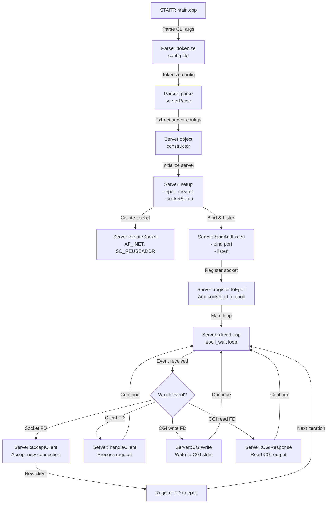

## Detailed Flow: Configuration Parsing

```mermaid
graph LR
    A["Parser::tokenize"] -->|Read config file| B["Character stream"]
    B -->|Split on braces/semicolons| C["Token vector"]
    C -->|Pass to parse| D["Parser::serverParse"]
    D -->|count_servers| E["Count server blocks"]
    E -->|For each server| F["Extract settings:<br/>listen, server_name<br/>error_pages"]
    F -->|locationParse| G["For each location:<br/>path, root, index<br/>methods, cgi map"]
    G -->|Return| H["vector of ServerConfig"]
    H -->|Build maps| I["init_errorpages<br/>error_pages map"]
```

## Detailed Flow: Socket Setup & Initialization

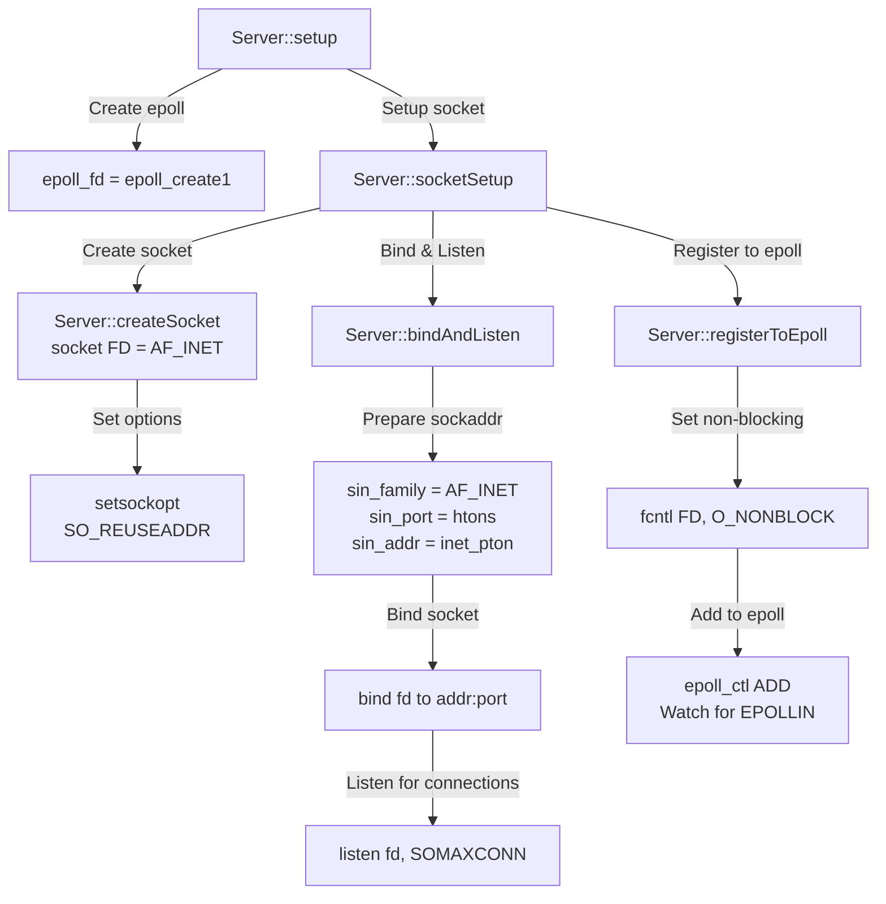

## Detailed Flow: Main Client Loop

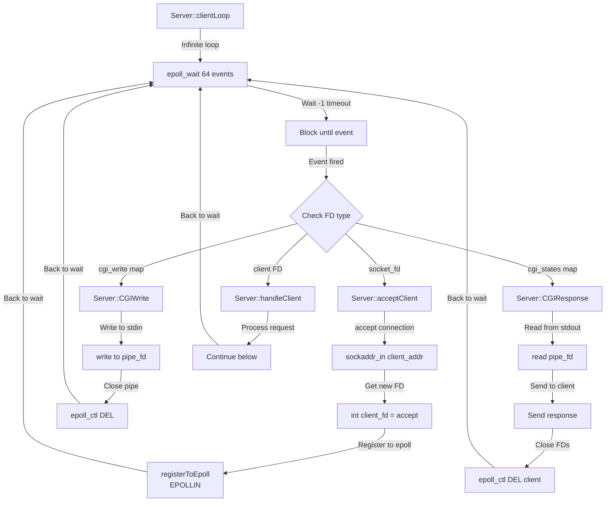

## Detailed Flow: Handle Client Request

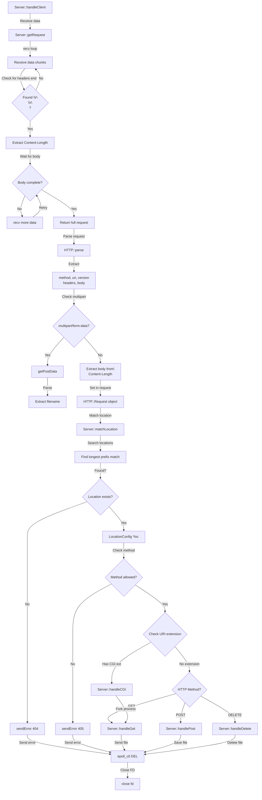

## Detailed Flow: GET Request Handler

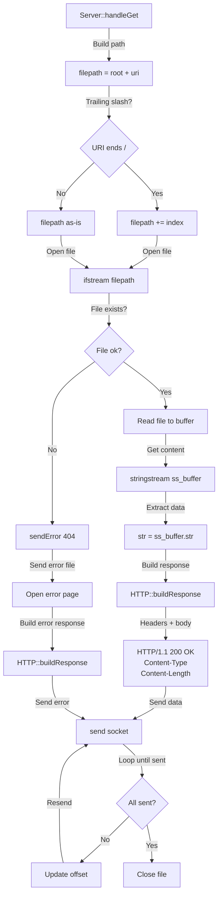

## Detailed Flow: POST Request Handler

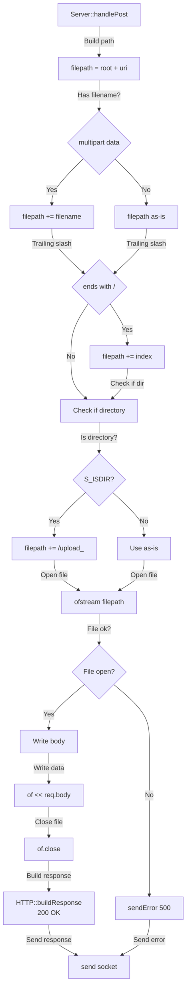

## Detailed Flow: DELETE Request Handler

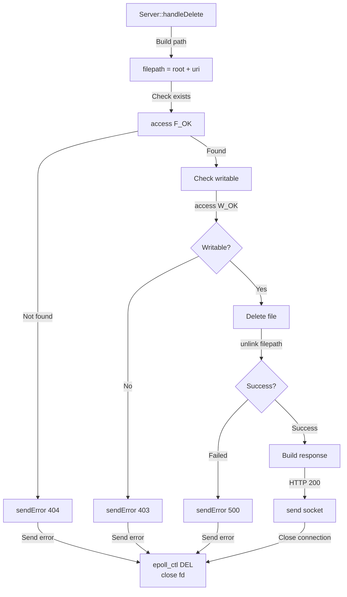

## Detailed Flow: CGI Execution (Parent Process)

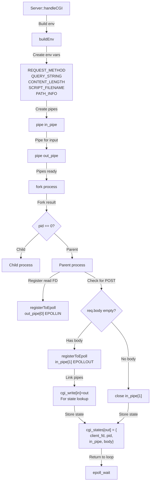

## Detailed Flow: CGI Execution (Child Process)

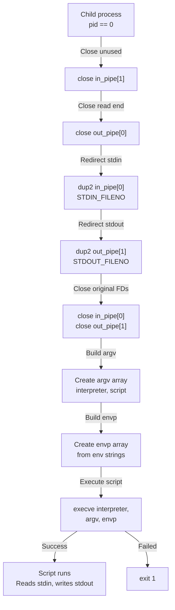

## Detailed Flow: CGI Write (POST Data to Child)

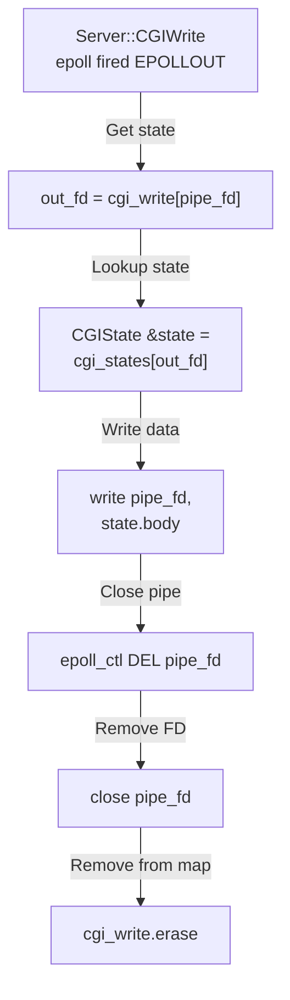

## Detailed Flow: CGI Response (Read from Child)

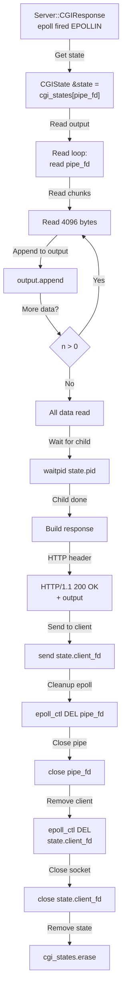

## Data Structures

### ServerConfig (from Parser.hpp)
```
- port: int
- host: string
- server_name: string
- max_body_size: size_t
- error_pages: map<int, string>
- locations: vector<LocationConfig>
```

### LocationConfig (from Parser.hpp)
```
- path: string
- root: string
- index: string
- auto_index: bool
- upload_store: string
- return_code: int
- return_url: string
- methods: vector<string>
- cgi: map<string, string>  // ext -> interpreter
```

### HTTP::Request (from HTTP.hpp)
```
- method: string (GET, POST, DELETE, etc)
- uri: string
- version: string
- query: string
- headers: map<string, string>
- body: string
- pd: postData {
    - file_name: string
    - type_name: string
    - empty: bool
  }
```

### CGIState (from Server.hpp)
```
- client_fd: int
- pid: pid_t
- in_pipe: int
- body: string
```

## Key Global Maps in Server Class

1. **cgi_write**: `map<int, int>`
   - Key: write pipe FD
   - Value: read pipe FD
   - Used to link write events back to state lookup

2. **cgi_states**: `map<int, CGIState>`
   - Key: read pipe FD (out_pipe[0])
   - Value: CGI state with client_fd, pid, write_fd, body
   - Used to manage CGI process lifecycle

## Error Handling Flow

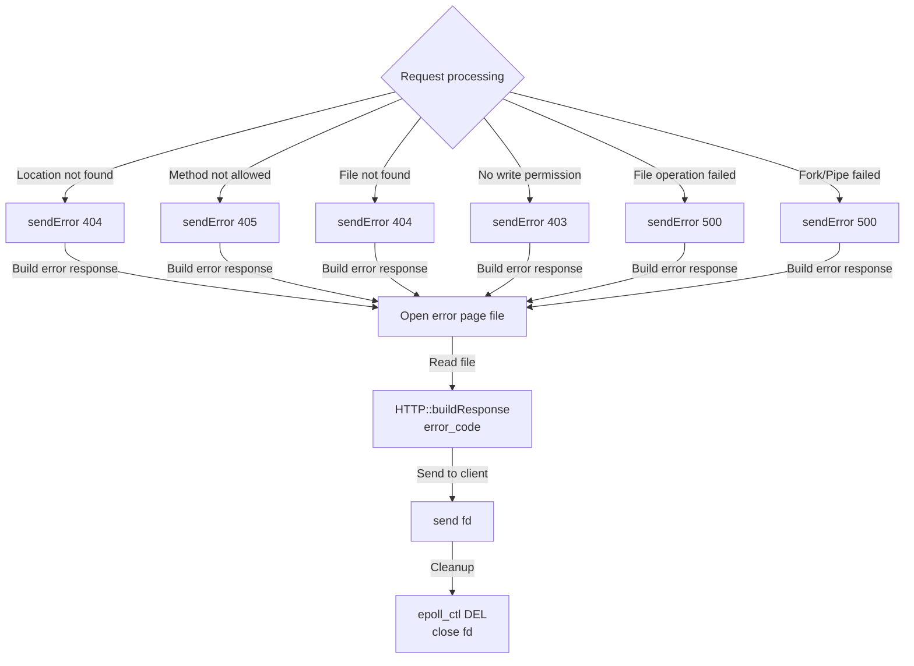

## File I/O Operations

### GET Request
```
1. Open file (ifstream)
2. Read entire file into buffer
3. Build HTTP response with Content-Type
4. Send response + body
5. Close file
6. Close client FD
```

### POST Request
```
1. Parse multipart form data if present
2. Extract filename from Content-Disposition
3. Build filepath (with directory detection)
4. Open file for writing (ofstream, truncate)
5. Write request body to file
6. Close file
7. Send HTTP 200 response
8. Close client FD
```

### DELETE Request
```
1. Check file exists (access F_OK)
2. Check write permission (access W_OK)
3. Delete file (unlink)
4. Send HTTP 200 or error
5. Close client FD
```

## Time Complexity Analysis

| Operation | Complexity | Notes |
|-----------|-----------|-------|
| Config parsing | O(n) | n = tokens |
| Location matching | O(m) | m = number of locations |
| Request parsing | O(p) | p = request size |
| epoll_wait | O(1) | Constant per event |
| File I/O | O(f) | f = file size |
| CGI execution | O(1) | fork + execve constant time |

## Process Architecture

```
┌─────────────────────────────────────┐
│  Parent Process (Server)            │
│  - epoll main loop                  │
│  - socket management                │
│  - file operations                  │
│  - fork on CGI requests             │
└─────────────────────────────────────┘
         │
         │ fork() for CGI
         ↓
┌─────────────────────────────────────┐
│  Child Process (CGI Script)         │
│  - stdin from parent's in_pipe[0]   │
│  - stdout to parent's out_pipe[1]   │
│  - exec script (Python/Shell)       │
│  - exit(0) when done                │
└─────────────────────────────────────┘
```

## Key Implementation Details

### Non-blocking I/O
- All sockets set to O_NONBLOCK via fcntl
- Allows epoll to manage multiple clients efficiently

### Pipe Communication (CGI)
- in_pipe: parent → child (script input/stdin)
- out_pipe: child → parent (script output/stdout)
- Parent writes to in_pipe[1], child reads from in_pipe[0]
- Child writes to out_pipe[1], parent reads from out_pipe[0]

### Event-Driven Model
- epoll_wait with -1 timeout blocks until event
- Handles up to 64 events per iteration
- Supports multiple concurrent clients

### Request Buffering
- Receives data in 4096-byte chunks
- Looks for "\r\n\r\n" header terminator
- Collects full body based on Content-Length

### CGI State Machine
- cgi_write map: tracks which processes need stdin written
- cgi_states map: tracks which processes need stdout read
- Both indexed by their respective pipe FDs
